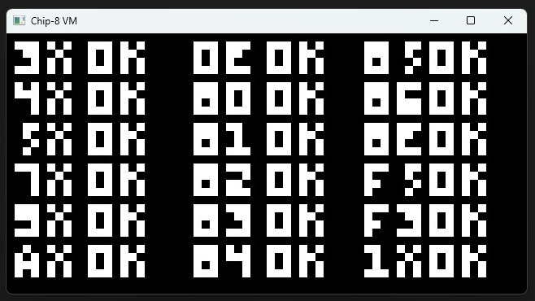
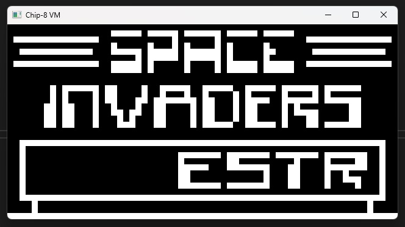

# chip8emulator
Chip8 emulator written in c

# Documentation
The code in the chip8.h and chip8.c is documented a lot. You should need no other informations.

# Structure
The implementation is in the chip8.h and chip8.c.

The implementation is decoupled from any os specific stuff like drawing or keyboard input.

The chip8_t struct holds a screenbuffer that the user can use to draw it on the screen, or do what ever.
Also there is a chip8_setkey(key, state) function the user can use to set the key state.

# Example
The main.c is an example implementation for windows of how to use the chip8.h and chip8.c.
I used freeglut for windowing and input, and fixed function pipline opengl to draw the chip8 screenbuffer.

You can use SDL2 or whatever library for windowing, drawing and input.

# Notes
The Games folder has three chip8 programs:
- IBM_Logo.ch8: Draws the IBM logo. This was used as a first test to see if the emulator works
- test_opcode.ch8: A test rom to test the chip8 emulator implementation
- Space_Invaders.ch8: Space invaders, nothing more to say :)

In chip8.h there is a `CHIP8_CYCLES_PER_FRAME` definition, use this to adjust the speed of the emulator